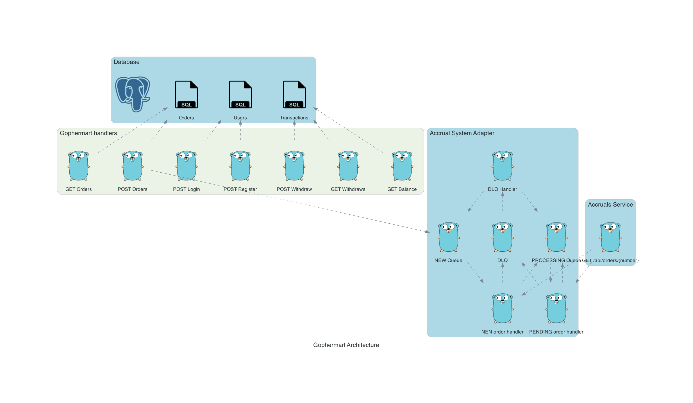
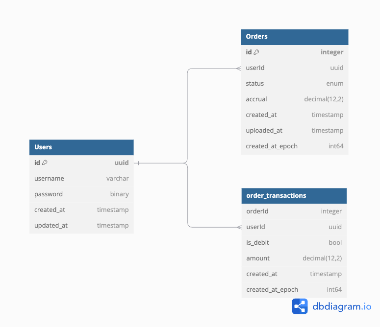

# architecture

# database schema


```sql
CREATE TABLE "Orders" (
  "id" integer PRIMARY KEY,
  "userId" uuid,
  "uploaded_at" timestamp
);

CREATE TABLE "Users" (
  "id" uuid PRIMARY KEY,
  "username" varchar,
  "password" binary,
  "registered_at" timestamp
);

CREATE TABLE "Transactions" (
  "id" int PRIMARY KEY,
  "orderId" integer,
  "userId" uuid,
  "type" enum,
  "withdraw" decimal(12,2),
  "finished_at" timestamp
);
```
